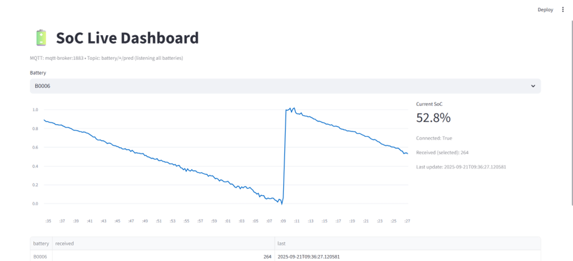
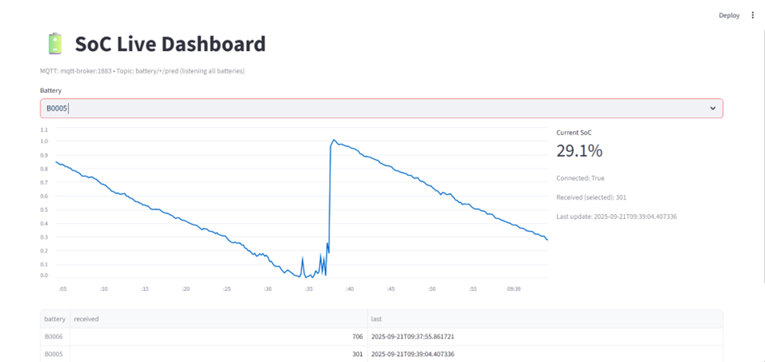
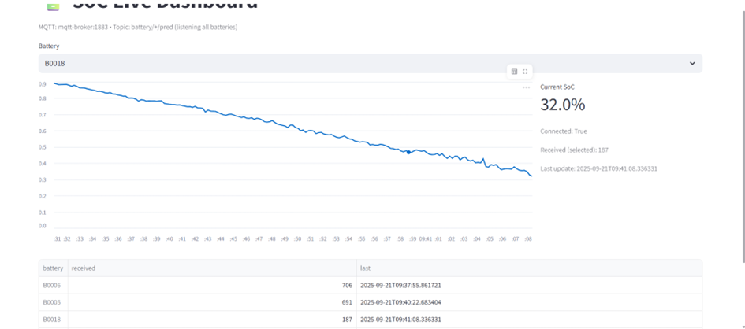

# Battery SoC – Demo Pipeline
- Proje Adı: Battery SoC – Demo Pipeline  
    **Ad Soyad:** Dilek YILMAZ
    **e-posta:** dilekyilmaz000@gmail.com
    **Tarih:** 21.09.2025

Gerçek zamanlı akıştan batarya SoC tahmini: veri → model → REST API → MQTT tüketicisi (worker) → Streamlit UI.

## 1) Hızlı Başlangıç

### Gereksinimler
- Docker Desktop (Linux/WSL/Windows/Mac)
- (Opsiyonel) Python 3.10+ ve `pip` (yerelde eğitim/eval için)

### Klasör Yapısı
.
├─ data/processed/ # B0005/B0006/B0018 parquet
├─ models/ # Serviste kullanılan model (model.pkl, meta.json)
├─ services/
│ ├─ api/ # FastAPI servis
│ ├─ worker/ # MQTT -> API -> MQTT
│ └─ ui/ # Streamlit dashboard
├─ tools/ # eğitim, değerlendirme, publisher scriptleri
├─ docker-compose.yml
├─ REPORT.md # teknik rapor
└─ README.md # bu dosya

## 2) Modeli Eğitme (opsiyonel)

Yerelde temel modeli eğitip `models/` klasörüne koyabilirsiniz.

**PowerShell (Windows):**
```powershell
python tools\train_service_model.py --engineered 0 --W 30 --H 1 --target soc_est --est hgb --outdir models_baseline
Remove-Item .\models -Recurse -Force; New-Item -ItemType Directory .\models | Out-Null
robocopy .\models_baseline .\models /E
komutlar:
python tools/train_service_model.py --engineered 0 --W 30 --H 1 --target soc_est --est hgb --outdir models_baseline
rm -rf models && mkdir models
cp -r models_baseline/* models/

## 3) Docker ile Çalıştırma
docker compose up -d --build

Servisler:

MQTT broker: localhost:1883

API (FastAPI): localhost:8000

Sağlık kontrolü: curl http://127.0.0.1:8000/health

UI (Streamlit): http://127.0.0.1:8501

Loglar:
docker compose logs -f api
docker compose logs -f worker
docker compose logs -f ui

## 4) Canlı Akış Testleri

Terminal 1 – veri yayını (örnek B0006):
python tools/mqtt_publisher.py --file data/processed/B0006.parquet \
  --host 127.0.0.1 --port 1883 --topic battery/B0006 --delay 0.2
# B0005
python tools/mqtt_publisher.py --file data/processed/B0005.parquet \
  --host 127.0.0.1 --port 1883 --topic battery/B0005 --delay 0.2

# B0018
python tools/mqtt_publisher.py --file data/processed/B0018.parquet \
  --host 127.0.0.1 --port 1883 --topic battery/B0018 --delay 0.2

Tarayıcı – UI:

http://127.0.0.1:8501 → üstteki Battery seç–kutusundan (B0005/B0006/B0018) seç

Grafik akışı ve son SoC metriği görünür

## 5) Değerlendirme (Offline)

Özet metrikleri üretir ve models/eval_summary.csv dosyasına yazar:
python tools/eval_models.py --target soc_est

## 6) Sorun Giderme (Troubleshooting)

API 8000 portu cevap vermiyor

docker compose ps → api “Up” olmalı

docker compose logs -f api içinde model.pkl/meta.json bulunamadı hatasına bakın

models/ klasörünün bind edildiğini doğrulayın (compose içindeki volumes)

UI açılıyor ama batarya listesi boş

Önce publisher’ı başlatın (MQTT’ye veri gelsin)

worker loglarında /predict çağrısı ve api’de 200 logları görülmeli

Saat farkı (UTC vs Lokal)

UI, lokal saat gösterir; gerekirse app.py içinde strftime('%d.%m.%Y %H:%M:%S') ile sabitleyin

## UI Önizleme

**B0006 Canlı Akış Örneği**

**B0005 Canlı Akış Örneği**

**B00018 Canlı Akış Örneği**

