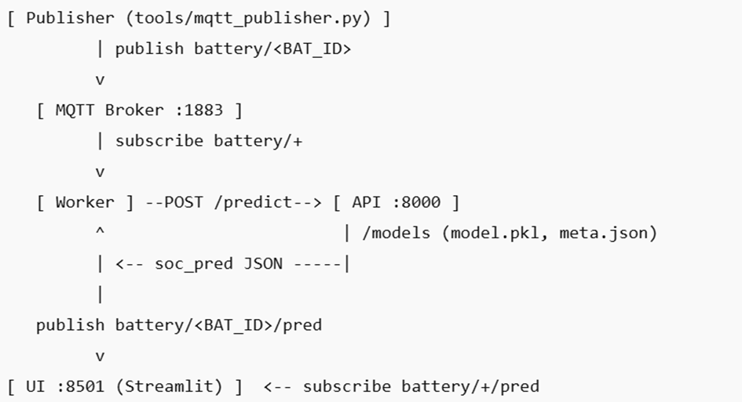

Yedtek Battery SoC – Teknik Çözüm Raporu
1) Özet
Bu çalışma; hücre ölçü akışından (V, I, T) SoC tahmini üretip canlıda yayınlayan uçtan-uca bir mimari kurar.
Akış: MQTT publisher → Worker (pencereleme + API çağrısı) → FastAPI (model) → MQTT (tahmin yayını) → Streamlit UI (canlı grafik).
Model, pencere boyutu W=30, ufuk H=1 ile V/I/T tabanında eğitildi (“baseline”). İsteğe bağlı “engineered” özellik (dV, rolling mean/std vs.) varyantı da sağlandı ve offline kıyaslandı.
Neden sadece [V, I, T]?
Basit, hızlı ve sensör bağımlılığı düşük. Üstüne “engineered” paket (dV/dt, rolling mean/std…) opsiyonel olarak eklenebilir—bazı split’lerde fayda sağladı, bazılarında genelleme zayıfladı. Canlı serviste bu yüzden baseline seçildi.
________________________________________
2) Veri & Özellikler
•	Girdi Parquet kolonları: voltage_v, current_a, temp_c, soc_est (hedef).
•	Pencereleme: W=30 (her tahmin için son 30 örnek), ufuk H=1 (1 adım ileri).
•	Baseline özellik seti: [V, I, T]
•	Engineered (opsiyonel): dV, V_ma, V_std, I_ma, I_std, T_ma, T_std (MA_N=5).
 

3) Mimari
•	mqtt-broker (Mosquitto): 1883/TCP
•	api (FastAPI): /predict, modeli /models’ten yüklüyor
•	worker: battery/+’ı dinler, pencere dolunca API’ye POST eder, sonucu battery/<BAT_ID>/pred’e yazar
•	ui (Streamlit): battery/+/pred dinler, seçilen pil için canlı grafik

 
 
________________________________________
4) Kurulum & Çalıştırma
4.1. Eğitim (servise alınacak modelin reprodüksiyonu)
# baseline model (V, I, T), W=30, H=1
python tools/train_service_model.py \
  --engineered 0 --W 30 --H 1 --target soc_est --est hgb --outdir models_baseline
Çıktılar:
•	models_baseline/model.pkl (joblib ile dump edilmiş sklearn pipeline)
•	models_baseline/meta.json (W/H/özellik listesi/est bilgisi)

4.2. Modeli servise koyma

# 1) /models klasörünü temiz kur
Remove-Item .\models -Recurse -Force -ErrorAction SilentlyContinue
New-Item -ItemType Directory .\models | Out-Null

# 2) Eğitilen modeli kopyala (models_baseline → models)
robocopy .\models_baseline .\models /E

# 3) (İsteğe bağlı) içerik kontrolü
Get-ChildItem .\models
 

4.3. Servisleri başlatma
docker compose up -d
•	UI: http://localhost:8501
•	(API health kontrolü konteyner içinden)
•	docker compose exec worker sh -lc "wget -qO- http://api:8000/health"
  
4.4. Canlı akış (her batarya için ayrı test)

•	B0006
 

•	B0005 

 

•	B0018 

 
 
________________________________________
5) Model
•	Estimator: HistGradientBoostingRegressor (HGBR); alternatif olarak hızlı “Ridge” baseline da scriptte mevcut.
•	Eğitim pipeline’ı StandardScaler + Estimator (tutarlılık için).
•	Servis girişi: (W,F) matrisini tek satıra reshape ederek POST.
•	Servis çıkışı: {"soc_pred": <float>, "horizon": 1, "window": W, "features": [...]}
________________________________________
6) Değerlendirme (Offline)
tools/eval_models.py --target soc_est ile holdout ve cross-battery (leave-one-battery-out) değerlendirmeleri yapıldı.
Özet:
scenario	split	setup	MAE	RMSE	R²
HOLDOUT	ALL→ALL	base_W30_H1	0.0280	0.0606	0.9627
HOLDOUT	ALL→ALL	eng_W60_H5	0.0176	0.0566	0.9675
XBAT	TRAIN != B0005	base_W30_H1	0.0417	0.0750	0.9429
XBAT	TRAIN != B0005	eng_W60_H5	0.0458	0.1193	0.8554
XBAT	TRAIN != B0006	base_W30_H1	0.0826	0.1252	0.8447
XBAT	TRAIN != B0006	eng_W60_H5	0.0926	0.1683	0.7192
XBAT	TRAIN != B0018	base_W30_H1	0.1006	0.1335	0.8157
XBAT	TRAIN != B0018	eng_W60_H5	0.0919	0.1752	0.6822
Yorum:
•	Holdout’ta engineered set bir miktar daha iyi.
•	Cross-battery’de (genelleme) engineered her zaman üstün değil; bazı pillere göre degrade.
•	Bu nedenle canlı serviste baseline modeli tuttuk; engineered varyant kolay tak-çıkar durumda.

 ________________________________________
7) “Bir bataryayla eğit, diğerleriyle test et” & MQTT akışında gösterim
•	Offline tarafı eval_models.py’de XBAT satırlarında yer alıyor (leave-one-battery-out).
•	Canlı akışta ise publisher’ı sadece bir pille çalıştırıp UI’dan farklı pilleri seçerseniz veri gelmediği pil grafiği doğal olarak durur; aktif yayın yapılan pilde akış sürer. (UI, battery/+/pred’i dinler; gelen piller listesi otomatik güncellenir.)
________________________________________
8) Sınırlılıklar & Sonraki Adımlar
•	Genelleme: Cross-battery sonuçlarında engineered özellikler bazı pil dağılımlarında aşırı uyum gösterebiliyor → daha çok pil verisiyle yeniden eğitim ve/veya domain shift’e dayanıklı yöntemler önerilir.
•	Ufuk & pencere taraması: W/H ızgara taraması ve LSTM/GRU gibi sıralı modeller denenebilir.
•	Model versiyonlama: models/ altında tarih–versiyonlu klasörler; worker’ın API URL ve model meta’sını loglaması; basit bir “roll-back” prosedürü eklenebilir.
•	Zaman damgası: UI tarafında lokal saat/UTC gösterimi tutarlılaştırıldı; istenirse sabit format (örn. %d.%m.%Y %H:%M:%S) kullanılabilir.
________________________________________

9) Çalıştırma Notları 
•	docker compose up -d → api/worker/ui “Up” olmalı.
•	Worker loglarında API error görürseniz:
1.	models/ altında model.pkl + meta.json var mı?
2.	api konteyneri “Up” mı? (bkz. docker compose ps)
3.	Worker içinden health:
4.	docker compose exec worker sh -lc "wget -qO- http://api:8000/health"
•	UI’da pil listesi boşsa: publisher başlatılmamış olabilir.
________________________________________
10) Üretken AI Kullanımı:
Bu çalışma sırasında üretken yapay zeka yardımı, özellikle komut akışlarının hazırlanması, hata ayıklama önerileri ve rapor iskeletinin oluşturulmasında destek olarak kullanılmıştır. Tüm komutlar ve kod parçaları yerelde doğrulanmış, çalıştırılmış ve çıktıların tutarlılığı elle kontrol edilmiştir.
________________________________________
11) Teslim İçeriği
•	Kod & Docker Compose
  - Tüm servis klasörleri: `services/api`, `services/worker`, `services/ui`
  - Kökte `docker-compose.yml`
•	Rapor (REPORT.md)
  - Bölümler: Veri → Model → API/Worker → UI → Değerlendirme → Üretken AI Beyanı → Sınırlılıklar
•	Değerlendirme Çıktısı
  - `models/eval_summary.csv`
•	Eğitilmiş Model Artifaktları
  - `models/` içinde `model.pkl` ve `meta.json`

